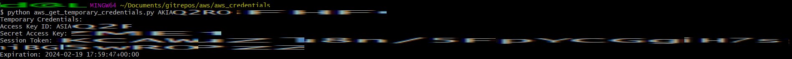
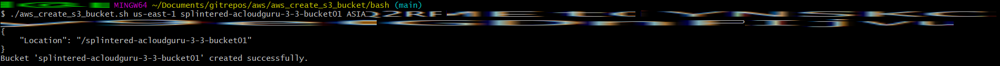
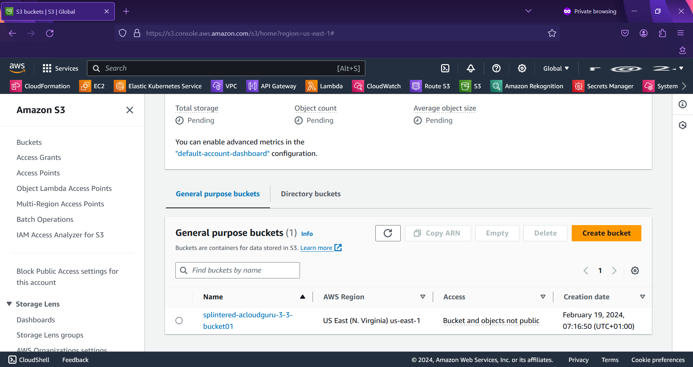
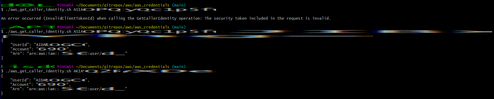

# Credentials

Scripts to get temporary credentials and to get the caller identity given permanent/temporary credentials.

## Get Temporary Credentials

Parameters:

Permanent Access Key Id

Permanent Secret Access Key

Note that an AWS Permanent Access Key starts with AKIA, but the temporary one starts with ASIA.

## Get Caller Identity

Parameters:

Permanent/Temporary Access Key Id

Permanent/Temporary Secret Access Key

(OPTIONAL) Session Token

The Session Token must be passed if you are using temporary credentials

## Tests

### Get Temporary Credentials

### Create S3 Bucket with Temporary Credentials

### Get Caller Identity

You must pass the Session Token when using temporary credentials.  Note that the same user is returned for both calls, the call with temporary credentials (access key id begins with ASIA) and the call with permanent credentials (access key id begins with AKIA).

